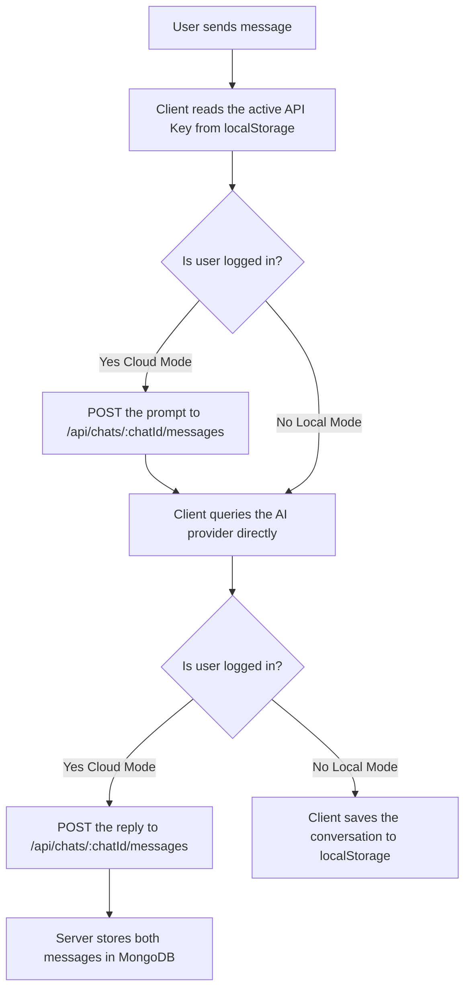

# 🤖 [Switchat](https://switchat.gabrielcbmd.com/)

[](https://react.dev/)
[](https://expressjs.com/)
[](https://www.mongodb.com/)
[](https://www.typescriptlang.org/)
[](https://pnpm.io/)

**Switchat** is a modern hybrid platform designed to connect and manage conversations with multiple Artificial Intelligence Large Language Models (LLMs). It allows users to chat seamlessly with **Google Gemini**, **Anthropic Claude**, **OpenAI**, and local models via **LM Studio** or **Ollama**, offering both secure cloud synchronization (with a MongoDB database) and a 100% local/private mode.

---

## 📑 Table of Contents

- [🌟 Key Features](#-key-features)
- [Prerequisites](#prerequisites)
- [Database setup](#database-setup)
- [Install and use](#install-and-use)
- [📂 Project Structure](#-project-structure)
- [🛠️ Tech Stack](#-tech-stack)
- [🚀 Deployment](#-deployment)
- [📋 API Documentation (Backend)](#-api-documentation-backend)
  - [Authentication (`/api/auth`)](#authentication-apiauth)
  - [Chat & Message Management (`/api/chats`)](#chat--message-management-apichats)
  - [API Key Custody (`/api/keys`)](#api-key-custody-apikeys)
- [🧠 AI Query Flow](#-ai-query-flow)
- [📄 License](#-license)

---

## 🌟 Key Features

- ✨ **Use now** without any installation or registration in **Offline Mode**: [Switchat](https://switchat.gabrielcbmd.com/)
- ☁️ **Cloud Sync & Local Mode**:
  - **Online Mode (With Session)**: Automatically syncs your chats, real-time messages, and drafts to **MongoDB**.
  - **Offline Mode (No Session)**: Respects your privacy by storing all your data exclusively in `localStorage`.
  - In **both** modes your browser calls the AI providers directly with your own API Keys — the server never talks to a provider. Signing in only adds cloud storage.
- 🔐 **Opt-in API Key sync**: signing in never uploads a key. Each key has its own button to store it in the database, encrypted with AES-256-GCM, so it follows you across devices — and another to take it back out while keeping it in your browser.

- 🧠 **Multi-Provider AI**: Dynamically switch between **Google Gemini**, **Anthropic Claude**, **OpenAI (ChatGPT)**, and local inference servers (**LM Studio**, **Ollama**) from a unified configuration settings menu. Each chat remembers the model it was using, so switching models in one conversation never disturbs another.
- 💭 **Per-chat Reasoning Control**: Adjust the extended-thinking/reasoning effort from the Settings panel. The level belongs to the chat, and it is re-resolved against that chat's model whenever the model changes — the scale runs from `off` up to `high`, or `xhigh` on the models that offer it. Models outside the registry (hand-typed IDs, LM Studio, Ollama) expose no slider at all.
- 📝 **Per-chat System Prompt**: Give each chat its own persistent system prompt to steer the AI's tone, role, or constraints, with a toggle that disables it without throwing the text away.
- 🔑 **Robust Authentication**: Secure registration and login protected with password hashing via `bcrypt` and route authorization using signed, `HttpOnly` JSON Web Tokens (`JWT`) cookies.
- ⚡ **Incremental Message Pagination**: Performance optimization that loads messages in batches of 6 using a time-based cursor (`before` / `limit`), speeding up rendering for long chat histories.
- 📐 **Responsive, Adjustable Layout**: Resizable sidebar using a drag-and-drop divider on desktop, plus a mobile-friendly drawer layout on smaller screens.
- 🗒️ **Notes Panel**: Jot down notes alongside your chats, or right-click any selected message text to send it straight to Notes.

---

## ⚠️ The following steps are only needed if you want to run this locally or contribute
## To use the app, just visit: [Switchat](https://switchat.gabrielcbmd.com/)

### Prerequisites
- **Node.js** `^20.19.0` or `>=22.12.0` — the minimum required by Vite 8. Older versions fail at `pnpm build`.
- **pnpm** (Optional, but recommended package manager).
- A **MongoDB** database — either hosted on Atlas or one you run yourself. See below.

### Database setup

Switchat stores accounts, chats and messages in MongoDB, and finds it through the
`MONGO_URI` variable. There are two routes; pick one and keep the resulting URI at
hand, you will paste it into `.env` in step 5.

#### Route A — MongoDB Atlas (hosted, nothing to install)

Fastest way to get running, and the free tier is enough for personal use.

1. Create an account at [mongodb.com/cloud/atlas](https://www.mongodb.com/cloud/atlas) and
   create a cluster (the **M0** tier is free).
2. **Database Access → Add New Database User.** Choose password authentication and note
   the username and password down; this is not your Atlas account login.
3. **Network Access → Add IP Address.** Add the address your app connects from. Atlas
   offers `0.0.0.0/0` here, which means *any host on the internet may attempt to
   connect* — then your password is the only thing standing in the way, so prefer a
   specific address whenever you know it.
4. **Cluster → Connect → Drivers → Node.js** and copy the connection string.
5. Replace `<db_password>` with the password from step 2, and insert the database name
   just before the `?`:

   ```
   MONGO_URI=mongodb+srv://<user>:<password>@cluster0.xxxxx.mongodb.net/switchat?retryWrites=true&w=majority
   ```

   Without that database name Mongo connects to a default one and your collections end
   up somewhere you did not intend.

#### Route B — Your own MongoDB

No account, no network round-trip, and it works offline. This is the recommended setup
for development, and what the deployed instance uses in production.

**Install it — macOS:**

```bash
brew tap mongodb/brew
brew install mongodb-community
brew services start mongodb-community
```

**Install it — Ubuntu / Debian:**

```bash
curl -fsSL https://pgp.mongodb.com/server-8.0.asc | sudo gpg --dearmor -o /usr/share/keyrings/mongodb-server-8.0.gpg
echo "deb [ arch=amd64,arm64 signed-by=/usr/share/keyrings/mongodb-server-8.0.gpg ] https://repo.mongodb.org/apt/ubuntu jammy/mongodb-org/8.0 multiverse" | sudo tee /etc/apt/sources.list.d/mongodb-org-8.0.list
sudo apt-get update && sudo apt-get install -y mongodb-org
sudo systemctl enable --now mongod
```

Check it answers, and you are done:

```bash
mongosh --eval 'db.version()'
```

```
MONGO_URI=mongodb://127.0.0.1:27017/switchat_dev
```

The database does not need to exist beforehand — Mongo creates it on the first write.
No username or password appears here because a stock install listens on `127.0.0.1`
only, so nothing outside your machine can reach it.

**On a server, add two things.** Once the database holds real accounts and encrypted
API keys, keep `bindIp: 127.0.0.1` in `/etc/mongod.conf` so the port is never exposed to
the internet, and turn authentication on. Create the user first, or you will lock
yourself out:

```bash
mongosh
```
```js
use switchat
db.createUser({
  user: "switchatApp",
  pwd: "<a-long-random-password>",
  roles: [{ role: "readWrite", db: "switchat" }]   // this database only, nothing else
})
```

Then enable authorization in `/etc/mongod.conf` and restart:

```yaml
security:
  authorization: enabled
```
```bash
sudo systemctl restart mongod
```
```
MONGO_URI=mongodb://switchatApp:<password>@127.0.0.1:27017/switchat
```

On a small VPS, also cap the cache in `/etc/mongod.conf` — by default WiredTiger claims
around half of the machine's RAM and will fight Node for it:

```yaml
storage:
  wiredTiger:
    engineConfig:
      cacheSizeGB: 0.25
```

Since the port stays closed, reaching that database from your own machine means going
through SSH. Forward it to a **different local port** than your own MongoDB, so both can
run at once and the port number alone tells you which database you are about to write
to:

```bash
ssh -N -L 27018:127.0.0.1:27017 <your-server>    # production is now at 127.0.0.1:27018
```

<details>
<summary><b>Troubleshooting:</b> <code>brew services start</code> fails with <code>Bootstrap failed: 5</code></summary>

MongoDB is distributed through a third-party tap, which recent Homebrew versions load in
a restricted mode that skips the formula's service definition. The generated
`~/Library/LaunchAgents/homebrew.mxcl.mongodb-community.plist` ends up with an empty
`ProgramArguments`, and `launchctl` rejects it. Either trust the tap
(`brew trust mongodb/brew`) and reinstall, or run the server directly:

```bash
mongod --config /opt/homebrew/etc/mongod.conf
```
</details>

### Install and use

1. Clone the repository:
   ```bash
   git clone https://github.com/gabrielcbmdaa/switchat
   ```
2. Navigate to the root directory:
   ```bash
   cd switchat
   ```
3. Install all dependencies:
   ```bash
   pnpm install
   ```
4. Go to server folder:
   ```bash
   cd server
   ```
5. Create your environment file:
   ```bash
   cp .env.example .env
   ```
   *Open .env and configure it with your variables. Each one is documented in `server/.env.example` and tagged `[REQUIRED]` or `[OPTIONAL]`. Three are required to start: `MONGO_URI` (the connection string from [Database setup](#database-setup)), `JWT_SECRET` and `ENCRYPTION_KEY`. One optional flag is worth knowing about: `REGISTRATION_ENABLED=false` closes new sign-ups — existing users can still log in, and `POST /auth/register` starts answering `403`.*

   Generate the two secrets with:
   ```bash
   openssl rand -base64 32   # JWT_SECRET
   openssl rand -base64 32   # ENCRYPTION_KEY (run it again: it must be a different value)
   ```
   *`ENCRYPTION_KEY` encrypts the API keys users sync to their account and must decode to exactly 32 bytes. The server refuses to start without it. Keep it separate from `JWT_SECRET` so leaking one does not compromise the other — and note that changing it makes every stored API key unreadable, at which point users simply re-enter them.*
6. Start and use:
   ```bash
   pnpm start
   ```
   The server will run on `http://localhost:3000`.
   Go to `http://localhost:3000/` in your browser to use the application.

7. Start to develop:
   ```bash
   pnpm dev
   ```
   *The client will run on `http://localhost:5173` (or the port assigned by Vite).*
   *The server will run on `http://localhost:3000`.*

---

## 📂 Project Structure

The repository is divided into a frontend (`client`) and a backend (`server`):

```text
switchat/
├── client/                 # React + Vite Frontend
│   ├── src/
│   │   ├── components/     # Shared components (Sidebar, SvgIcons, Toolbar...)
│   │   ├── services/       # API integration services (api.ts)
│   │   ├── utils/          # Utility scripts (resizer, storage, etc.)
│   │   ├── views/          # Main views (ChatView, MessageView, SettingsView, AccountView)
│   │   ├── App.tsx         # UI Entry point and global state
│   │   └── index.css       # Global styles and typographic variables
│   └── package.json
│
└── server/                 # Node + Express Backend
    ├── controllers/        # Logic controllers (authController, chatController, apiKeyController)
    ├── middleware/         # Authorization middleware (authMiddleware)
    ├── models/             # Mongoose database schemas (User, Chat, Message, ApiKey)
    ├── routes/             # Express API routing (authRoutes, chatRoutes, apiKeyRoutes)
    ├── services/           # Internal services (encryptionService: AES-256-GCM)
    ├── server.js           # Server startup and database connections
    └── package.json
```

---

## 🛠️ Tech Stack

### Frontend
- **React 19** & **Vite** for a fast and reactive Single Page Application (SPA).
- **TypeScript** for static typing and robust autocomplete support.
- **CSS Modules** for isolated styles, free of naming collisions.
- **Marked** for rendering AI markdown responses into HTML.
- **Space Grotesk** typography for a clean, modern aesthetic.

### Backend
- **Node.js** & **Express 5** for the API REST backend.
- **Mongoose** and the **Native MongoDB Client** working side-by-side.
- **JWT (JsonWebToken)** for session management and route protection.
- **Bcrypt** for hashing user credentials.
- Environment variables support via **dotenv**.

---

## 🚀 Deployment

Pushing to `main` automatically deploys to the production VPS via GitHub Actions (`.github/workflows/deploy.yml`), which connects over SSH and runs:

1. `git fetch origin` + `git reset --hard origin/main`
2. `pnpm install`
3. `pnpm build`
4. `pm2 restart switchat`

Requires these GitHub Secrets: `SSH_HOST`, `SSH_USER`, `SSH_PRIVATE_KEY`.

> ⚠️ `server/.env` lives only on the server and is never updated by the workflow. New environment variables must be added manually via SSH, followed by `pm2 restart switchat --update-env`.

---

## 📋 API Documentation (Backend)

All backend endpoints are prefixed with `/api`.

### Authentication (`/api/auth`)

| Method | Endpoint | Description | Requires Auth |
| :--- | :--- | :--- | :--- |
| `POST` | `/auth/register` | Registers a new user and signs them in. Hashes the password using `bcrypt`. Requires `acceptedTerms: true` in the body (`400` otherwise), and answers `403` when the server runs with `REGISTRATION_ENABLED=false`. | No |
| `POST` | `/auth/login` | Logs in a user and sets a signed, `HttpOnly` session cookie (JWT) valid for 7 days. | No |
| `POST` | `/auth/logout` | Clears the session cookie, logging the user out. | No |
| `GET` | `/auth/me` | Checks whether the current session cookie is still valid. | Yes (Session Cookie) |
| `PATCH` | `/auth/email` | Changes the account email. Requires `currentPassword`; the new address is normalized and rejected if another account already uses it. | Yes (Session Cookie) |
| `PATCH` | `/auth/password` | Changes the password. Requires `currentPassword` and a `newPassword` of at least 6 characters. | Yes (Session Cookie) |
| `DELETE` | `/auth/account` | Permanently deletes the account along with its chats and messages, then clears the session cookie. Requires `currentPassword`. | Yes (Session Cookie) |

### Chat & Message Management (`/api/chats`)

| Method | Endpoint | Description | Requires Auth |
| :--- | :--- | :--- | :--- |
| `GET` | `/chats` | Retrieves all chats for the authenticated user, sorted by creation date. | Yes (Session Cookie) |
| `POST` | `/chats` | Syncs (creates or updates) a chat or draft in the database (upsert). | Yes (Session Cookie) |
| `DELETE` | `/chats/:id` | Permanently deletes a chat and all its associated messages. | Yes (Session Cookie) |
| `GET` | `/chats/:chatId/messages`| Returns messages from a chat (optional query parameters: `limit` and `before`). | Yes (Session Cookie) |
| `POST` | `/chats/:chatId/messages`| Stores a single message (`sender`: `user` or `ai`) and returns its id. Verifies the chat belongs to you. | Yes (Session Cookie) |
| `DELETE` | `/chats/:chatId/messages/:messageId`| Permanently deletes a single message from a chat. | Yes (Session Cookie) |

### API Key Custody (`/api/keys`)

The server stores these encrypted with AES-256-GCM and never uses them to call a provider — only your browser does that. `GET` returns them decrypted because the browser needs them usable, so the encryption protects against a database dump, not against a stolen session. Only the keys the user explicitly chose to store are ever sent here: signing in downloads keys, it never uploads them.

| Method | Endpoint | Description | Requires Auth |
| :--- | :--- | :--- | :--- |
| `GET` | `/keys` | Returns the account's API keys, decrypted. Records that cannot be decrypted are skipped. | Yes (Session Cookie) |
| `PUT` | `/keys` | Replaces the whole set. Keys absent from the body are deleted, which is how deletions propagate between devices. | Yes (Session Cookie) |

---

## 🧠 AI Query Flow

The browser always calls the AI provider directly, with the user's own API key. Being logged in changes **where the conversation is stored**, never who talks to the provider — the server is storage only.



The prompt is stored *before* the provider is queried, so closing the tab mid-generation loses the reply but never the question — the retry button picks it up from there.

---

## 📄 License

This project is licensed under the MIT License - see the [LICENSE](LICENSE) file for details.
