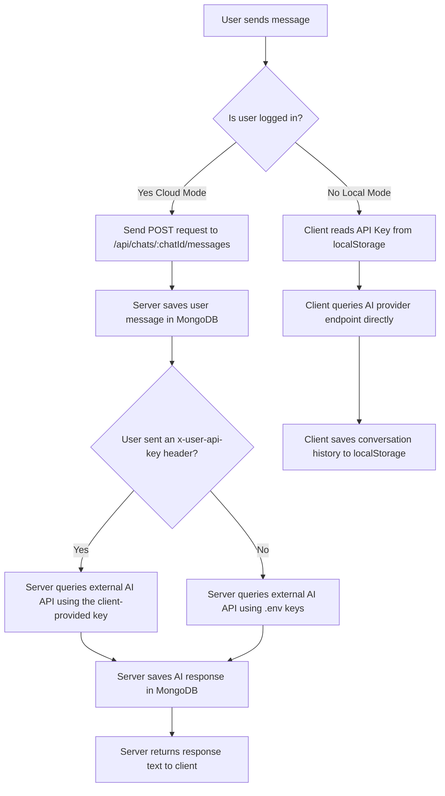

# 🤖 [Switchat](https://switchat.gabrielcbmd.com/)

[](https://react.dev/)
[](https://expressjs.com/)
[](https://www.mongodb.com/)
[](https://www.typescriptlang.org/)
[](https://pnpm.io/)

**Switchat** is a modern hybrid platform designed to connect and manage conversations with multiple Artificial Intelligence Large Language Models (LLMs). It allows users to chat seamlessly with **Google Gemini**, **Anthropic Claude**, **OpenAI**, and local models via **LM Studio** or **Ollama**, offering both secure cloud synchronization (with MongoDB Atlas databases) and a 100% local/private mode.

---

## 🌟 Key Features

- ✨ **Use now** without any installation or registration in **Offline Mode**: [Switchat](https://switchat.gabrielcbmd.com/)
- ☁️ **Cloud Sync & Local Mode**:
  - **Online Mode (With Session)**: Automatically syncs your chats, real-time messages, and drafts to **MongoDB Atlas**.
  - **Offline Mode (No Session)**: Respects your privacy by storing all your data exclusively in `localStorage` and making direct API requests to the AI providers using your own API Keys.

- 🧠 **Multi-Provider AI**: Dynamically switch between **Google Gemini**, **Anthropic Claude**, **OpenAI (ChatGPT)**, and local inference servers (**LM Studio**, **Ollama**) from a unified configuration settings menu.
- 💭 **Reasoning Control**: Adjust the extended-thinking/reasoning effort (`off` to `high`) per model directly from the Settings panel.
- 📝 **Custom System Prompt**: Set a persistent system prompt from Settings to steer the AI's tone, role, or constraints across every chat.
- 🔑 **Robust Authentication**: Secure registration and login protected with password hashing via `bcrypt` and route authorization using signed, `HttpOnly` JSON Web Tokens (`JWT`) cookies.
- ⚡ **Incremental Message Pagination**: Performance optimization that loads messages in batches of 6 using a time-based cursor (`before` / `limit`), speeding up rendering for long chat histories.
- 📐 **Responsive, Adjustable Layout**: Resizable sidebar using a drag-and-drop divider on desktop, plus a mobile-friendly drawer layout on smaller screens.
- 🗒️ **Notes Panel**: Jot down notes alongside your chats, or right-click any selected message text to send it straight to Notes.

---

## ⚠️ The following steps are only needed if you want to run this locally or contribute
## To use the app, just visit: [Switchat](https://switchat.gabrielcbmd.com/)

### Prerequisites
- **Node.js** (Version 18 or higher recommended).
- **pnpm** (Optional, but recommended package manager).
- A **MongoDB Atlas** account (or a local MongoDB database instance).

### Install and use

1. Clone the repository:
   ```bash
   git clone https://github.com/gabrielcbmdaa/switchat
   ```
2. Navigate to the root directory:
   ```bash
   cd switchat
   ```
3. Install all dependencies:
   ```bash
   pnpm install
   ```
4. Go to server folder:
   ```bash
   cd server
   ```
5. Create your environment file:
   ```bash
   cp .env.example .env
   ```
   *Open .env and configure it with your variables*
6. Start and use:
   ```bash
   pnpm start
   ```
   The server will run on `http://localhost:3000`.
   Go to `http://localhost:3000/` in your browser to use the application.

7. Start to develop:
   ```bash
   pnpm dev
   ```
   *The client will run on `http://localhost:5173` (or the port assigned by Vite).*
   *The server will run on `http://localhost:3000`.*

---

## 📂 Project Structure

The repository is divided into a frontend (`client`) and a backend (`server`):

```text
switchat/
├── client/                 # React + Vite Frontend
│   ├── src/
│   │   ├── components/     # Shared components (Sidebar, SvgIcons, Toolbar...)
│   │   ├── services/       # API integration services (api.ts)
│   │   ├── utils/          # Utility scripts (resizer, storage, etc.)
│   │   ├── views/          # Main views (ChatView, MessageView, SettingsView, AccountView)
│   │   ├── App.tsx         # UI Entry point and global state
│   │   └── index.css       # Global styles and typographic variables
│   └── package.json
│
└── server/                 # Node + Express Backend
    ├── controllers/        # Logic controllers (authController, chatController)
    ├── middleware/         # Authorization middleware (authMiddleware)
    ├── models/             # Mongoose database schemas (User, Chat, Message)
    ├── routes/             # Express API routing (authRoutes, chatRoutes)
    ├── server.js           # Server startup and database connections
    └── package.json
```

---

## 🛠️ Tech Stack

### Frontend
- **React 19** & **Vite** for a fast and reactive Single Page Application (SPA).
- **TypeScript** for static typing and robust autocomplete support.
- **CSS Modules** for isolated styles, free of naming collisions.
- **Marked** for rendering AI markdown responses into HTML.
- **Space Grotesk** typography for a clean, modern aesthetic.

### Backend
- **Node.js** & **Express 5** for the API REST backend.
- **Mongoose** and the **Native MongoDB Client** working side-by-side.
- **JWT (JsonWebToken)** for session management and route protection.
- **Bcrypt** for hashing user credentials.
- Environment variables support via **dotenv**.

---

## 📋 API Documentation (Backend)

All backend endpoints are prefixed with `/api`.

### Authentication (`/api/auth`)

| Method | Endpoint | Description | Requires Auth |
| :--- | :--- | :--- | :--- |
| `POST` | `/auth/register` | Registers a new user. Hashes the password using `bcrypt`. | No |
| `POST` | `/auth/login` | Logs in a user and sets a signed, `HttpOnly` session cookie (JWT) valid for 7 days. | No |
| `POST` | `/auth/logout` | Clears the session cookie, logging the user out. | No |
| `GET` | `/auth/me` | Checks whether the current session cookie is still valid. | Yes (Session Cookie) |

### Chat & Message Management (`/api/chats`)

| Method | Endpoint | Description | Requires Auth |
| :--- | :--- | :--- | :--- |
| `GET` | `/chats` | Retrieves all chats for the authenticated user, sorted by creation date. | Yes (Session Cookie) |
| `POST` | `/chats` | Syncs (creates or updates) a chat or draft in the database (upsert). | Yes (Session Cookie) |
| `DELETE` | `/chats/:id` | Permanently deletes a chat and all its associated messages. | Yes (Session Cookie) |
| `GET` | `/chats/:chatId/messages`| Returns messages from a chat (optional query parameters: `limit` and `before`). | Yes (Session Cookie) |
| `POST` | `/chats/:chatId/messages`| Sends a user message, queries the configured LLM, and saves both messages. | Yes (Session Cookie) |
| `DELETE` | `/chats/:chatId/messages/:messageId`| Permanently deletes a single message from a chat. | Yes (Session Cookie) |

---

## 🧠 AI Query Flow

The application processes AI completions in two different ways depending on whether the user is logged in:



---

## 📄 License

This project is licensed under the MIT License - see the [LICENSE](LICENSE) file for details.
